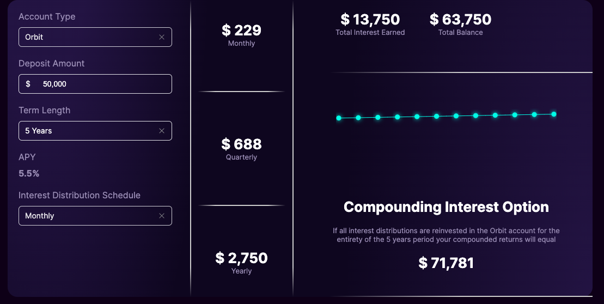

# Compound Interest Calculator

This is a compound interest calculator developed in React using the RSuite and Recharts libraries. The application calculates the earned interest and total accumulated balance for an investment account with different interest reinvestment options.

## Features

- Calculates compound interest and total accumulated balance for an investment account.
- Allows selection between two account types: Orbit and Odyssey.
- Enables adjustment of the initial deposit amount and investment period.
- Provides a graphical visualization of balance growth over time.

## Screenshots

## Installation

1. Clone this repository to your local machine.
2. Navigate to the project folder.
3. Run `npm install` to install the dependencies.
4. Run `npm start` to start the application in development mode.
5. Open [http://localhost:3000](http://localhost:3000) in your browser to view the application.

## Deployment

The main version of this application is hosted on [Vercel](https://calculator-five-gilt.vercel.app/).

## Contributions

Contributions are welcome. If you find a bug or have any ideas to improve the application, feel free to open an issue or send a pull request.

## Author

This application was developed by [Carlos Escorcia](https://github.com/carlospolo019).
